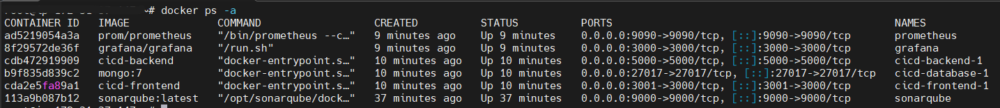
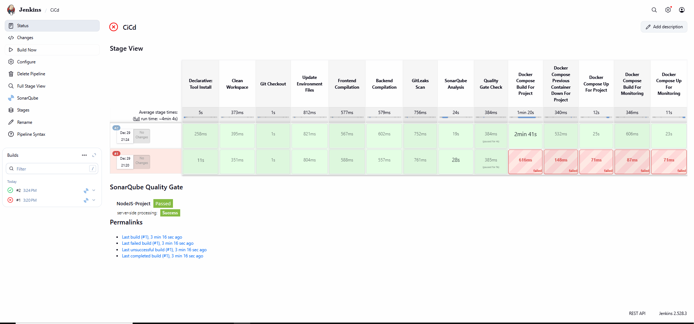
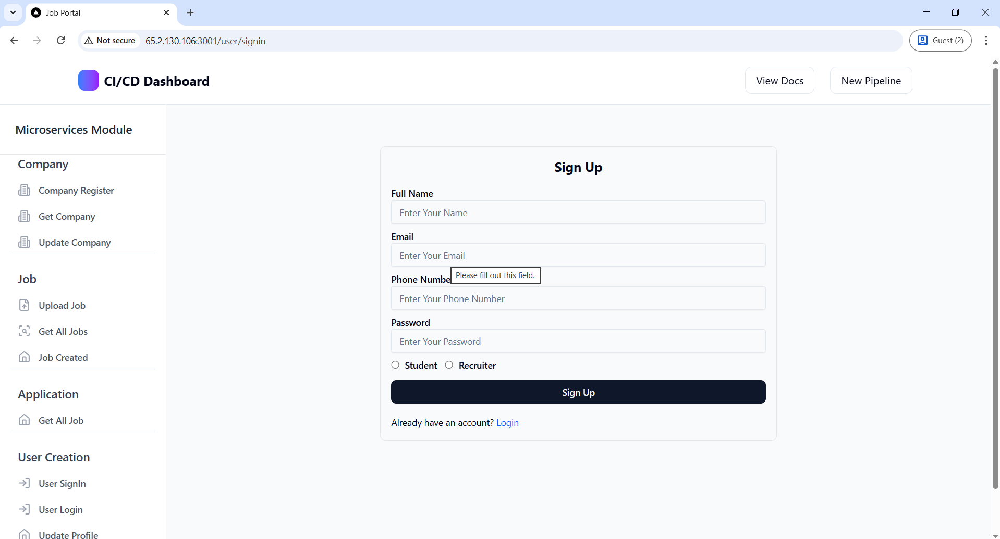
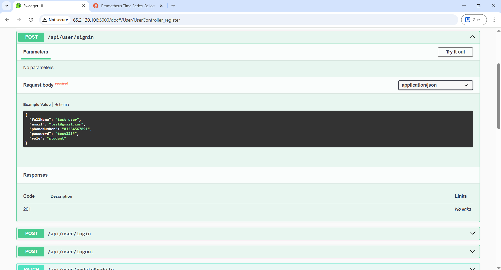
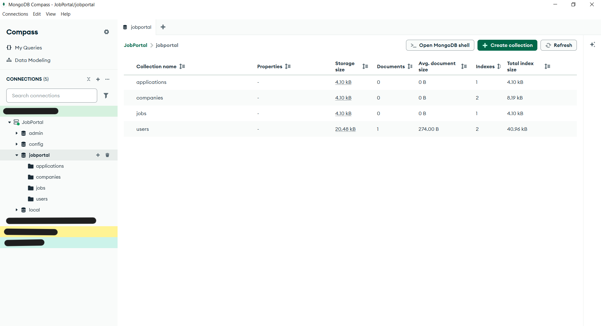
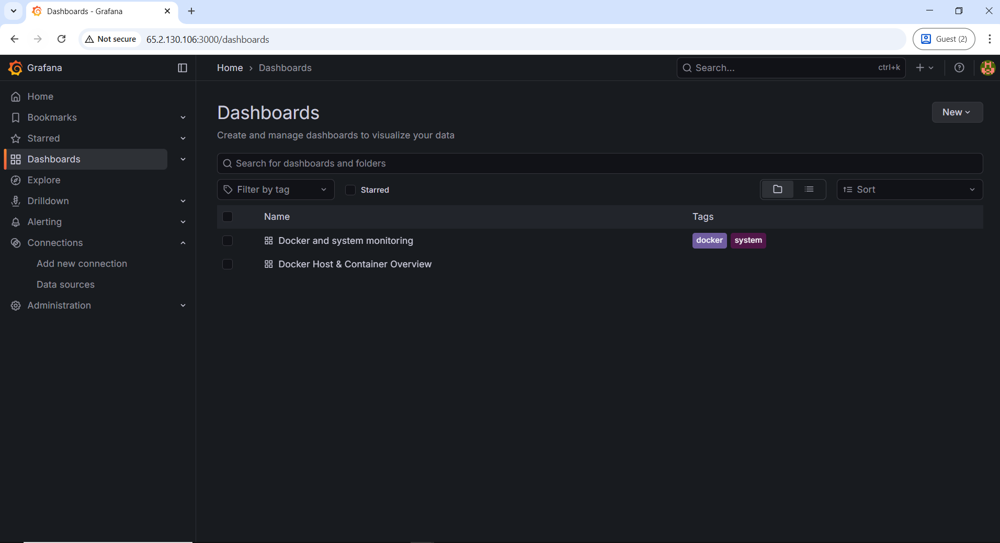

## CICD MERN Stack With Monitoring SetUp

- Lunch a Server with atleast 4 gb ram and 2 cpu and 30 gb memory
- We Need to Install Some package Like (trivy, gitleaks, docker, docker compose, and a container with sonarqube)

--

### First Install Jenkins for CICD

-> Jenkins.sh

```
#!/bin/bash

sudo apt update
sudo apt install fontconfig openjdk-21-jre
java -version

sudo wget -O /etc/apt/keyrings/jenkins-keyring.asc \
  https://pkg.jenkins.io/debian-stable/jenkins.io-2023.key
echo "deb [signed-by=/etc/apt/keyrings/jenkins-keyring.asc]" \
  https://pkg.jenkins.io/debian-stable binary/ | sudo tee \
  /etc/apt/sources.list.d/jenkins.list > /dev/null
sudo apt update
sudo apt install jenkins -y
```

--

### Secound We Need to Install docker and Docker Compose

-> docker.sh

```
#!/bin/bash

# Add Docker's official GPG key:
sudo apt update
sudo apt install ca-certificates curl
sudo install -m 0755 -d /etc/apt/keyrings
sudo curl -fsSL https://download.docker.com/linux/ubuntu/gpg -o /etc/apt/keyrings/docker.asc
sudo chmod a+r /etc/apt/keyrings/docker.asc

# Add the repository to Apt sources:
sudo tee /etc/apt/sources.list.d/docker.sources <<EOF
Types: deb
URIs: https://download.docker.com/linux/ubuntu
Suites: $(. /etc/os-release && echo "${UBUNTU_CODENAME:-$VERSION_CODENAME}")
Components: stable
Signed-By: /etc/apt/keyrings/docker.asc
EOF

sudo apt update

sudo apt install docker-ce docker-ce-cli containerd.io docker-buildx-plugin docker-compose-plugin
sudo systemctl start docker
sudo docker --version

sudo apt-get install docker-compose-plugin

sudo docker compose version
```

- The to exec docker command in jenkins agent we need to have jenkin agent docker permision

```
sudo usermod -aG docker jenkins

```

- To access the docker demon matrics
  vim /etc/docker/daemon.json

```
{
"metrics-addr": "0.0.0.0:9323"
}
```

systemctl restart docker

---

- We need to install some package for scan the vernability and security of docker image

```
# Install gitleaks For Check any confidential code are there
sudo apt install gitleaks

# Install libatomic1
sudo apt update
sudo apt install libatomic1

# Install trivy for docker image scanner
sudo apt-get install wget gnupg
wget -qO - https://aquasecurity.github.io/trivy-repo/deb/public.key | gpg --dearmor | sudo tee /usr/share/keyrings/trivy.gpg > /dev/null
echo "deb [signed-by=/usr/share/keyrings/trivy.gpg] https://aquasecurity.github.io/trivy-repo/deb generic main" | sudo tee -a /etc/apt/sources.list.d/trivy.list
sudo apt-get update
sudo apt-get install trivy

# For Code Quality Check we need to install sonarqube / So we are using sonarqube docker continer
docker run -it -d --name sonarqube -p 9000:9000 sonarqube:latest
```

---

## Sonarqube

- First login with Sonarqube
  - The server where docker sonarqube container is running
  - <ip>:9000
  - Login ->
  - Go to Account the go to security
    - <ip>:9000/account/security
  - inside Security Generate Generate Tokens

## Jenkins

- First Login With Jenkins
  <ip>:8080
- Then install some plugin
  - pipeline stage view\*
  - Sonarqube Scanner\*
  - docker\*
  - node.js
- On jenkins Dashboard in Security Credential create a secret token with the name of sonar-token
- on Dashboard manage jenkins in tools install ->
  - Sonarqube Scanner Installations install sonarqube
  - install nodejs name as nodejs
- Now go to Dashboard on System Sonarqube Servers -> Add name sonar then ip of that sonar container then set the token

- Now Create a Pipeline Name as CICD
- Now in code we need to modify something
  - prometheus-grafana/prometheus/prometheus.yaml

```
  global:
  scrape_interval: 15s
  evaluation_interval: 15s

alerting:
alertmanagers: - static_configs: - targets: []

scrape_configs:

- job_name: "prometheus"
  static_configs:

  - targets:
    - "prometheus:9090"

- job_name: "docker_daemon"
  metrics_path: /metrics
  static_configs:
  - targets:
    - <ip>:9323"
```

---

### Docker compose file for mern stack project

```
services:
  database:
    image: mongo:7
    ports:
      - 27017:27017
    networks:
      - mern-app
    volumes:
      - mongodb_data:/data/db
    environment:
      - MONGO_INITDB_ROOT_USERNAME=admin
      - MONGO_INITDB_ROOT_PASSWORD=badhon
  backend:
    build:
      context: ./backend
      dockerfile: Dockerfile
    ports:
      - 5000:5000
    depends_on:
      - database
    env_file:
      - ./backend/.env
    networks:
      - mern-app
    restart: always
  frontend:
    build:
      context: ./frontend
      dockerfile: Dockerfile
    ports:
      - 3001:3000
    networks:
      - mern-app
    env_file: ./frontend/.env
networks:
  mern-app:
    driver: bridge
volumes:
  mongodb_data:
    driver: local
```

---

# monitoring Docker Compose file

```
services:
  prometheus:
    image: prom/prometheus
    container_name: prometheus
    command:
      - '--config.file=/etc/prometheus/prometheus.yml'
    ports:
      - 9090:9090
    restart: unless-stopped
    volumes:
      - ./prometheus:/etc/prometheus
      - prom_data:/prometheus
  grafana:
    image: grafana/grafana
    container_name: grafana
    ports:
      - 3000:3000
    restart: unless-stopped
    environment:
      - GF_SECURITY_ADMIN_USER=admin
      - GF_SECURITY_ADMIN_PASSWORD=grafana
    volumes:
      - ./grafana:/etc/grafana/provisioning/datasources
volumes:
  prom_data:

```

---

### Jenkins Grovy

- Now write the I Copy my code from this repo

```
pipeline {
    agent any
    tools {
        nodejs 'nodejs'
    }
    environment{
        SCANNER_HOME = tool 'sonar-scanner'
    }
    stages {
         stage('Clean WorkStation') {
            steps {
               cleanWs()
            }
        }
        stage("Git Clone"){
            steps{
                git branch: 'docker', url: 'https://github.com/Badhon58/jobportal.git'
            }
        }
        stage('Stop All Running Container') {
            steps {
                     sh 'docker compose down'
            }
        }
        stage("Stop The Monitoring Tool"){
            steps{
                dir('prometheus-grafana') {
                     sh 'docker compose down'
                }
            }
        }
        stage('Update Environment Files') {
            steps {
                sh '''
                cat > backend/.env << 'EOF'
                PORT=5000
                DBURL=mongodb://admin:badhon@<ip>:27017/jobportal?authSource=admin
                SECRET_KEY=BadhonBiswas
                EOF
                '''

                // Update frontend .env file with EC2 IP
                sh '''
                cat > frontend/.env << 'EOF'
                NEXT_PUBLIC_API_URL=http://<ip>:5000/api
                EOF
                '''
            }
        }
        stage('Frontend Compilation') {
            steps {
                dir('frontend') {
                    sh 'find . -name "*.ts" -exec node --check {} +'
                }
            }
        }
        stage("Backend Compilation"){
            steps {
                dir('backend') {
                    sh 'find . -name "*.ts" -exec node --check {} +'
                }
            }
        }
        stage("GitLeaks Scan"){
            steps {
                sh 'gitleaks detect --source ./frontend --report-format json --report-path gitleaks-report.json || true'
                sh 'gitleaks detect --source ./backend --report-format json --report-path gitleaks-report.json || true'
            }
        }
        stage('SonarQube Analysis') {
            steps {
                withSonarQubeEnv('sonar-scanner') {
                    sh ''' $SCANNER_HOME/bin/sonar-scanner -Dsonar.projectName=NodeJS-Project \
                            -Dsonar.projectKey=NodeJS-Project '''
                }
            }
        }
        stage('Quality Gate Check') {
            steps {
                timeout(time: 1, unit: 'HOURS') {
                    waitForQualityGate abortPipeline: false, credentialsId: 'sonar-scanner'
                }
            }
        }
        stage("Docker Compose Build for Project"){
            steps{
                sh 'docker compose up -d'
            }
        }
        stage("Prometheus & Grafana"){
            steps{
                dir('prometheus-grafana') {
                     sh 'docker compose up -d'
                }
            }
        }
    }
}

```

---

## Image of This project

### Docker Container Running



### Jenkins Pipeline View



### Sonarqube


### Nextjs Frontend



### Nest.js Backend



### Database



### Monitoring



### Database


